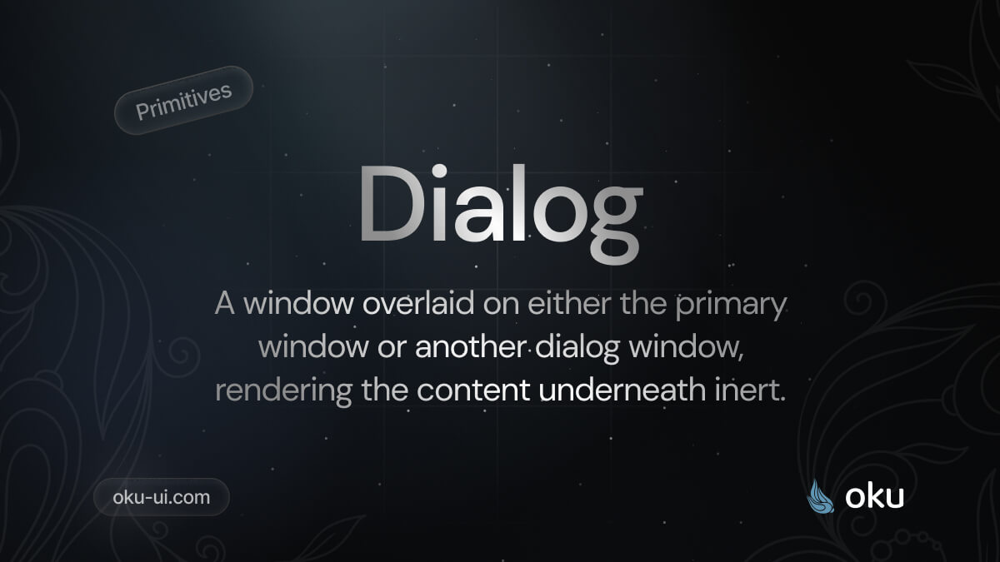

# Dialog
A window overlaid on either the primary window or another dialog window, rendering the content underneath inert.



<span><a href="https://www.npmjs.com/package/@oku-ui/label "></a> </span> | <span> <a href="https://www.npmjs.com/package/@oku-ui/label">  </a> </span> | <span> <a href="https://oku-ui.com/primitives/components/label"></a> </span>

## Installation

```sh
$ pnpm add @oku-ui/label
```

[Documentation](https://oku-ui.com/primitives/components/dialog)
