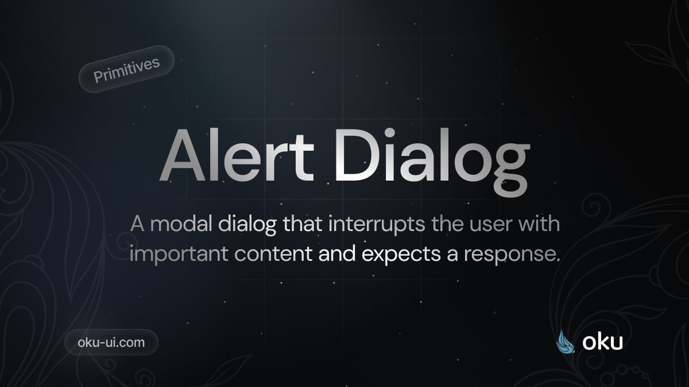

# AlertDialog
Renders an accessible label associated with controls.



<span><a href="https://www.npmjs.com/package/@oku-ui/alert-dialog "></a> </span> | <span> <a href="https://www.npmjs.com/package/@oku-ui/alert-dialog">  </a> </span> | <span> <a href="https://oku-ui.com/primitives/components/alert-dialog"></a> </span>

## Installation

```sh
$ pnpm add @oku-ui/alert-dialog
```

[Documentation](https://oku-ui.com/primitives/components/alert-dialog)
