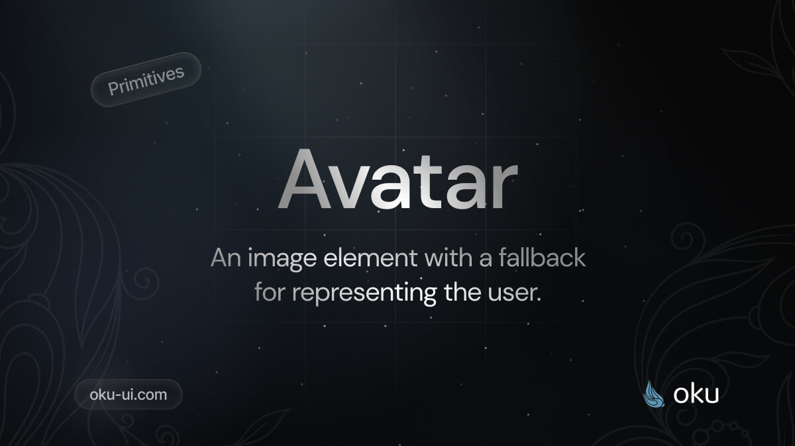

# Avatar
An image element with a fallback for representing the user.



[](https://www.npmjs.com/package/@oku-ui/avatar) [](https://www.npmjs.com/package/@oku-ui/avatar)

## Installation

```sh
$ pnpm add @oku-ui/avatar
```

[Documentation](https://oku-ui.com/primitives/components/avatar)