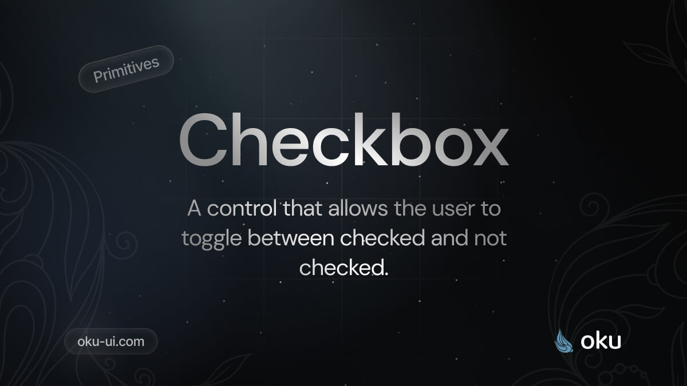

# Checkbox
A control that allows the user to toggle between checked and not checked.



[](https://www.npmjs.com/package/@oku-ui/checkbox) [](https://www.npmjs.com/package/@oku-ui/checkbox)

## Installation

```sh
$ pnpm add @oku-ui/checkbox
```

[Documentation](https://oku-ui.com/primitives/components/checkbox)