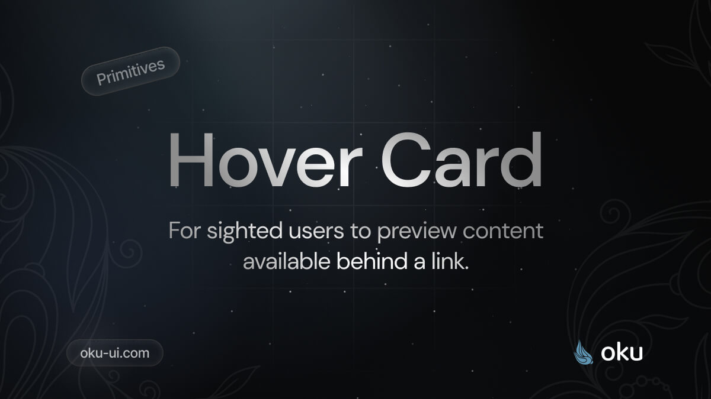

# Hover Card
For sighted users to preview content available behind a link.



<span><a href="https://www.npmjs.com/package/@oku-ui/hover-card "></a> </span> | <span> <a href="https://www.npmjs.com/package/@oku-ui/hover-card">  </a> </span> | <span> <a href="https://oku-ui.com/primitives/components/hover-card"></a> </span>

## Installation

```sh
$ pnpm add @oku-ui/hover-card
```

[Documentation](https://oku-ui.com/primitives/components/hover-card)
