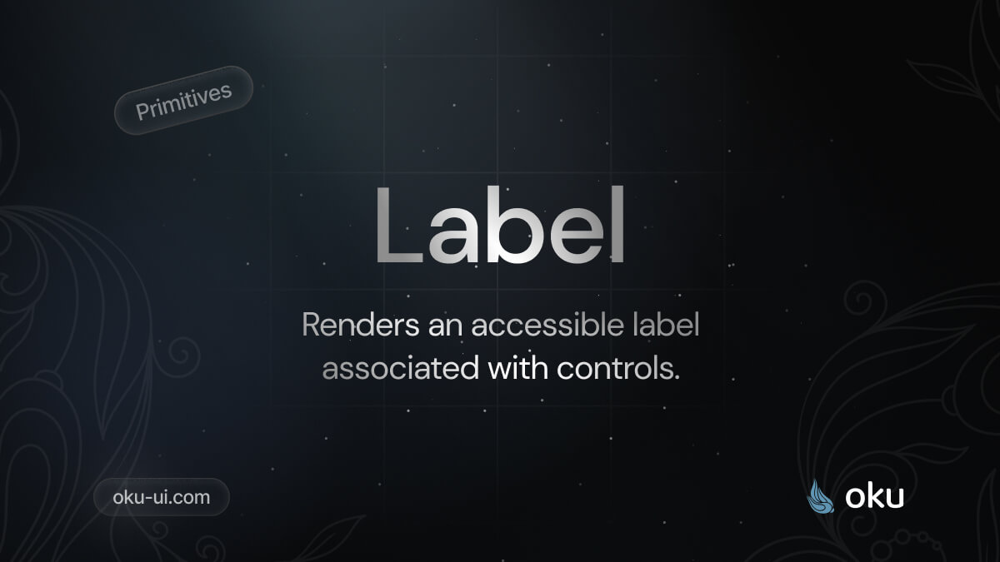

# Label
Renders an accessible label associated with controls.



[](https://www.npmjs.com/package/@oku-ui/label) [](https://www.npmjs.com/package/@oku-ui/label)

## Installation

```sh
$ pnpm add @oku-ui/label
```

[Documentation](https://oku-ui.com/primitives/components/label)