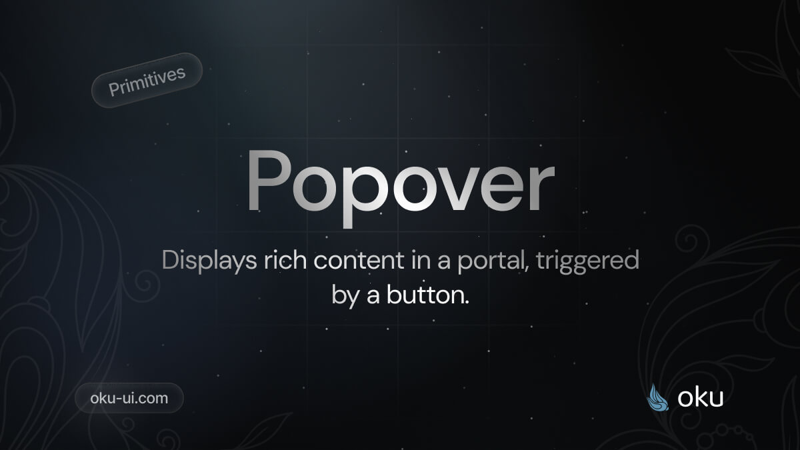

# Popover
Displays rich content in a portal, triggered by a button.




<span><a href="https://www.npmjs.com/package/@oku-ui/popover "></a> </span> | <span> <a href="https://www.npmjs.com/package/@oku-ui/popover">  </a> </span> | <span> <a href="https://oku-ui.com/primitives/components/popover"></a> </span>

## Installation

```sh
$ pnpm add @oku-ui/popover
```

[Documentation](https://oku-ui.com/primitives/components/popover)
