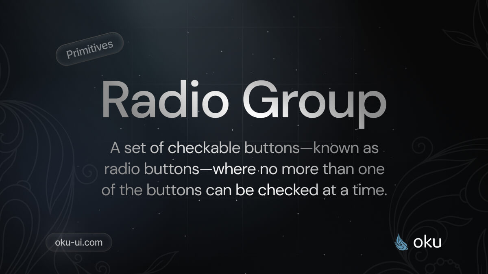

# Radio Group
A set of checkable buttons—known as radio buttons—where no more than one of the buttons can be checked at a time.



[](https://www.npmjs.com/package/@oku-ui/radio-group) [](https://www.npmjs.com/package/@oku-ui/radio-group)

## Installation

```sh
$ pnpm add @oku-ui/radio-group
```

[Documentation](https://oku-ui.com/primitives/components/radio-group)