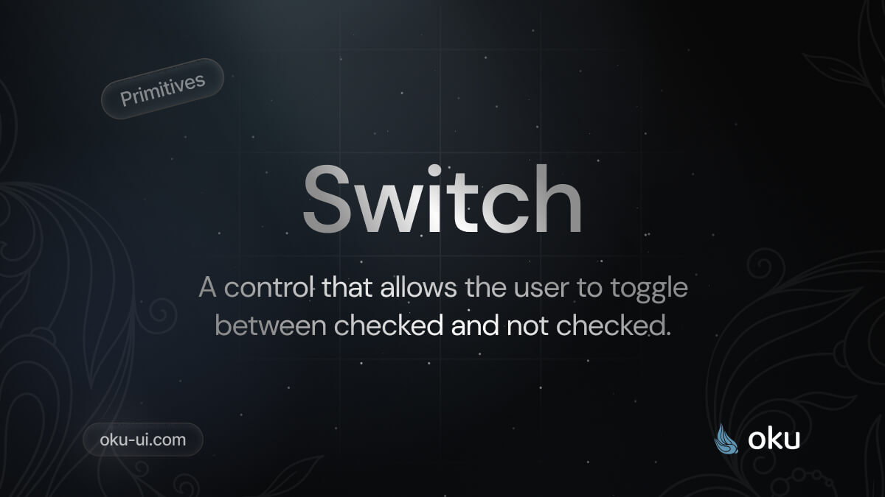

# Switch
A control that allows the user to toggle between checked and not checked.



<span><a href="https://www.npmjs.com/package/@oku-ui/switch "></a> </span> | <span> <a href="https://www.npmjs.com/package/@oku-ui/switch">  </a> </span> | <span> <a href="https://oku-ui.com/primitives/components/switch"></a> </span>

## Installation

```sh
$ pnpm add @oku-ui/switch
```

[Documentation](https://oku-ui.com/primitives/components/switch)