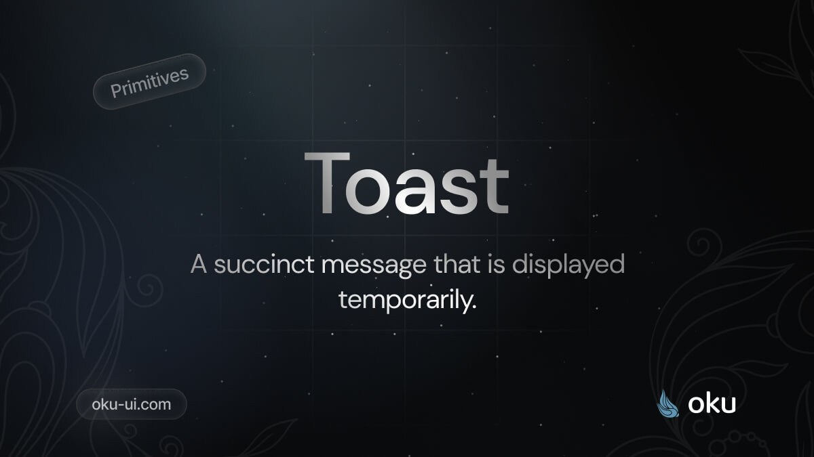

# Toast
A succinct message that is displayed temporarily.



[](https://www.npmjs.com/package/@oku-ui/toast) [](https://www.npmjs.com/package/@oku-ui/toast)

## Installation

```sh
$ pnpm add @oku-ui/toast
```

[Documentation](https://oku-ui.com/primitives/components/toast)
