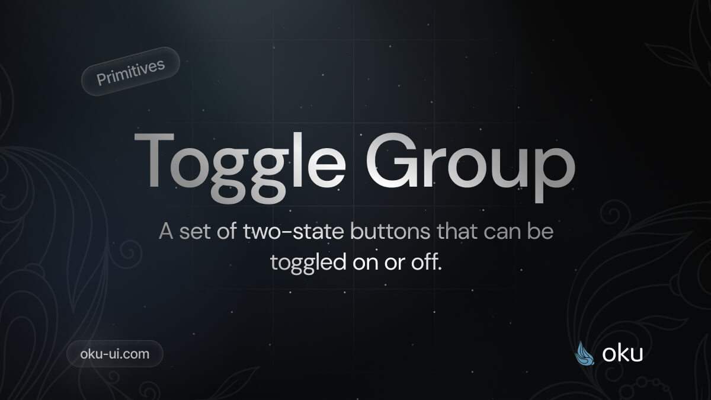

# Toggle Group
A set of two-state buttons that can be toggled on or off.




[](https://www.npmjs.com/package/@oku-ui/toggle-group) [](https://www.npmjs.com/package/@oku-ui/toggle-group)

## Installation

```sh
$ pnpm add @oku-ui/toggle-group
```

[Documentation](https://oku-ui.com/primitives/components/toggle-group)