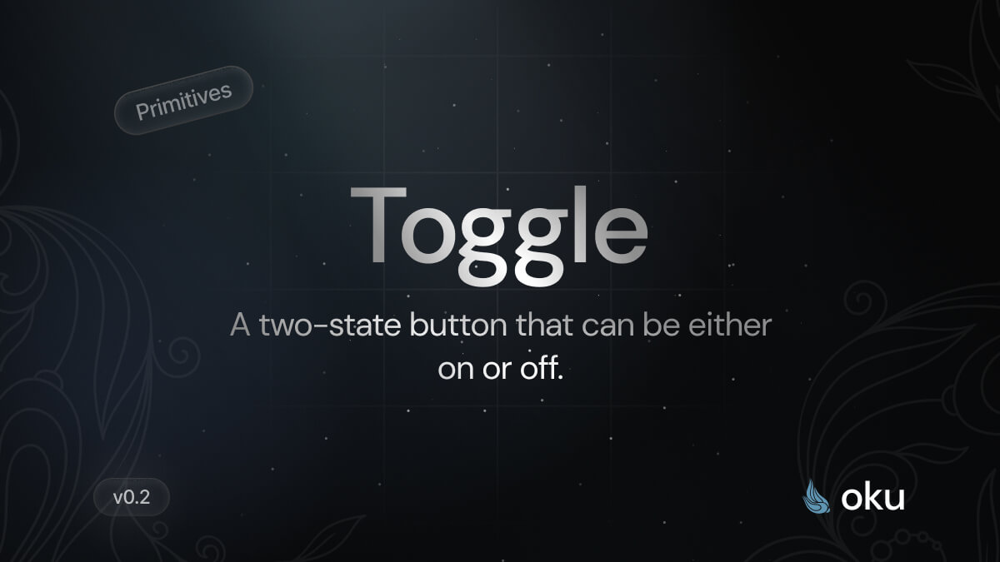

# Toggle
A two-state button that can be either on or off.



<span><a href="https://www.npmjs.com/package/@oku-ui/toggle "></a> </span> | <span> <a href="https://www.npmjs.com/package/@oku-ui/toggle">  </a> </span> | <span> <a href="https://oku-ui.com/primitives/components/toggle"></a> </span>

## Installation

```sh
$ pnpm add @oku-ui/toggle
```
[Documentation](https://oku-ui.com/primitives/components/toggle)
