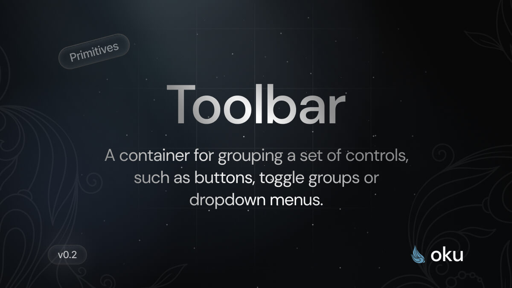

# Toolbar
A container for grouping a set of controls, such as buttons, toggle groups or dropdown menus.



[](https://www.npmjs.com/package/@oku-ui/toolbar) [](https://www.npmjs.com/package/@oku-ui/toolbar)

## Installation

```sh
$ pnpm add @oku-ui/toolbar
```

[Documentation](https://oku-ui.com/primitives/components/toolbar)