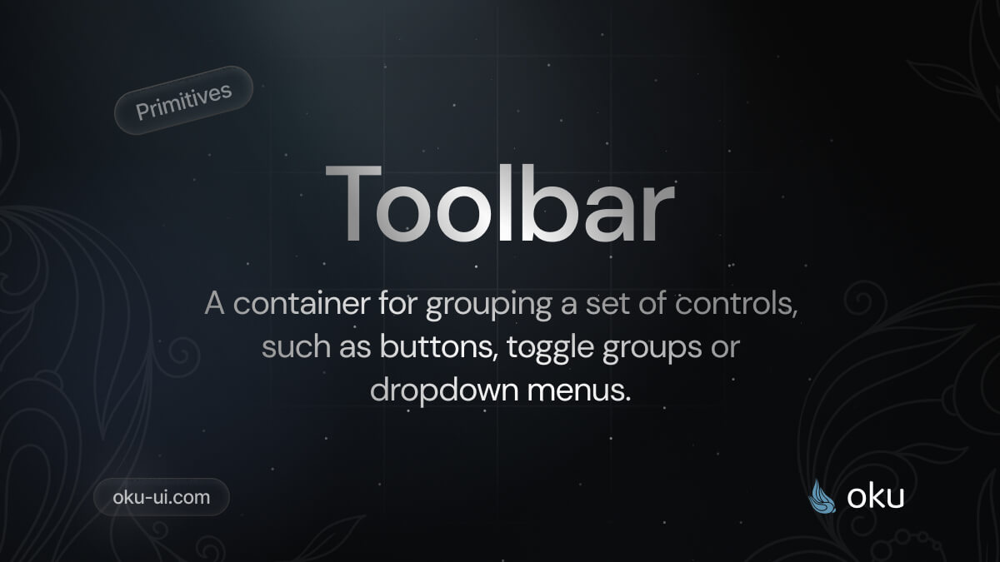

# Toolbar
A container for grouping a set of controls, such as buttons, toggle groups or dropdown menus.



<span><a href="https://www.npmjs.com/package/@oku-ui/toolbar "></a> </span> | <span> <a href="https://www.npmjs.com/package/@oku-ui/toolbar">  </a> </span> | <span> <a href="https://oku-ui.com/primitives/components/toolbar"></a> </span>

## Installation

```sh
$ pnpm add @oku-ui/toolbar
```

[Documentation](https://oku-ui.com/primitives/components/toolbar)
