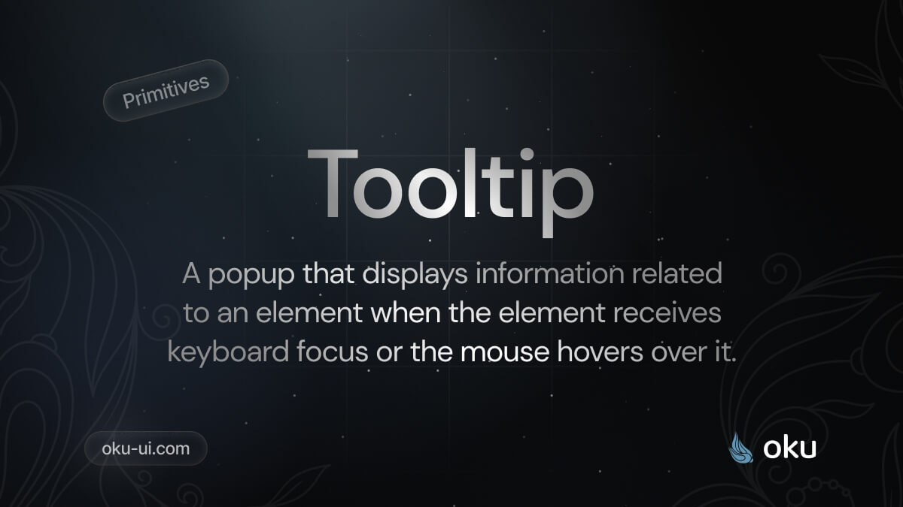

# Tooltip
A popup that displays information related to an element when the element receives keyboard focus or the mouse hovers over it.



<span><a href="https://www.npmjs.com/package/@oku-ui/tooltip "></a> </span> | <span> <a href="https://www.npmjs.com/package/@oku-ui/tooltip">  </a> </span> | <span> <a href="https://oku-ui.com/primitives/components/tooltip"></a> </span>

## Installation

```sh
$ pnpm add @oku-ui/tooltip
```

[Documentation](https://oku-ui.com/primitives/components/tooltip)
