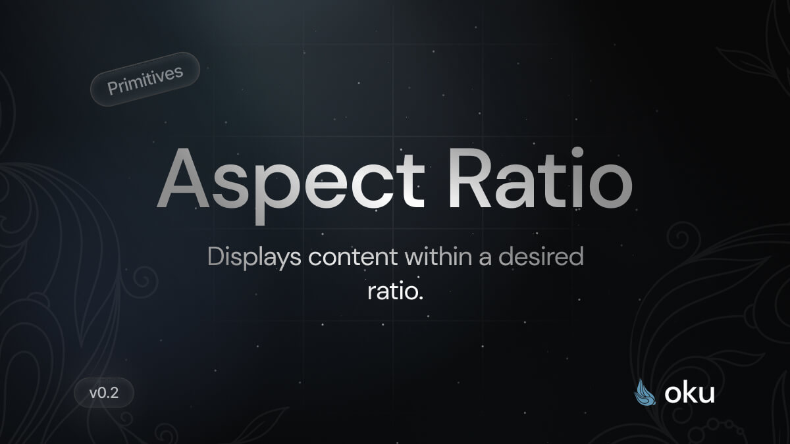

# Aspect Ratio
Displays content within a desired ratio.



[](https://www.npmjs.com/package/@oku-ui/aspect-ratio) [](https://www.npmjs.com/package/@oku-ui/aspect-ratio)

## Installation

```sh
$ pnpm add @oku-ui/aspect-ratio
```

[Documentation](https://oku-ui.com/primitives/components/aspect-ratio)
