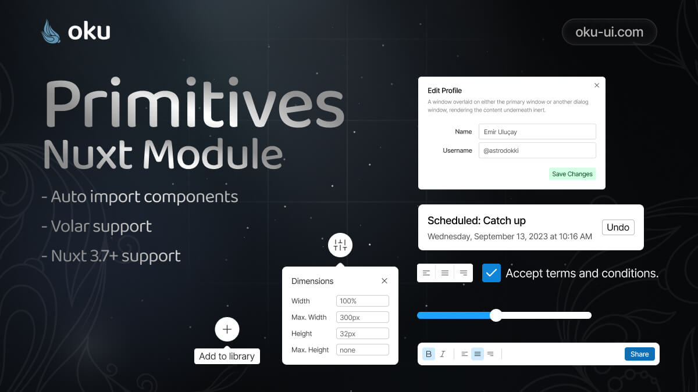

# Primitives Nuxt Module
Oku Primitives Nuxt Module



<span><a href="https://www.npmjs.com/package/@oku-ui/primitives-nuxt"></a> </span> | <span> <a href="https://www.npmjs.com/package/@oku-ui/primitives-nuxt">  </a> </span> | <span> <a href="https://oku-ui.com/primitives/components/primitives-nuxt"></a> </span>

## Installation

```sh
$ pnpm add @oku-ui/primitives-nuxt
```

[Documentation](https://oku-ui.com/primitives/introduction/nuxt)


## Credits
- [Nuxt Devtools](https://github.com/nuxt/devtools)
- [Nuxt SEO Kit](https://github.com/harlan-zw/nuxt-seo-kit)